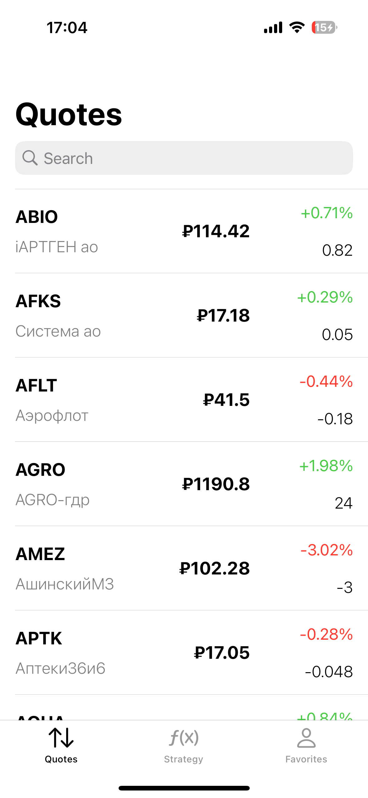
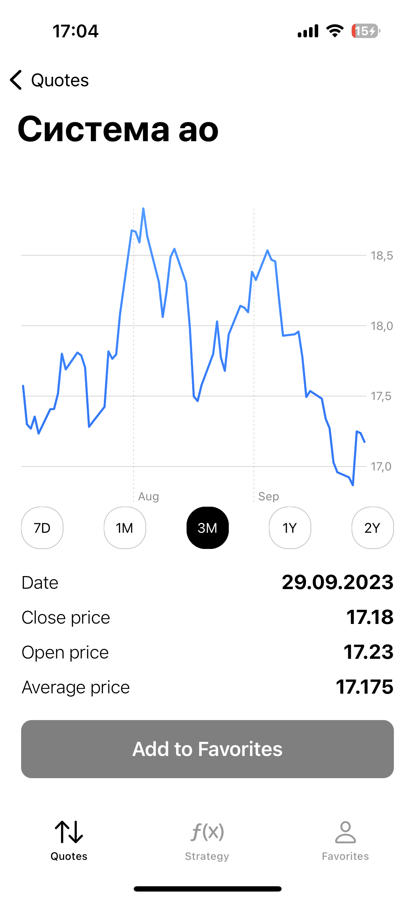
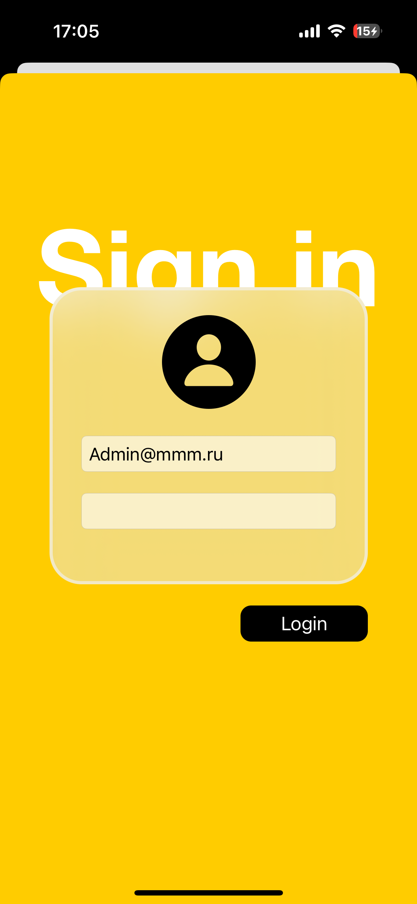
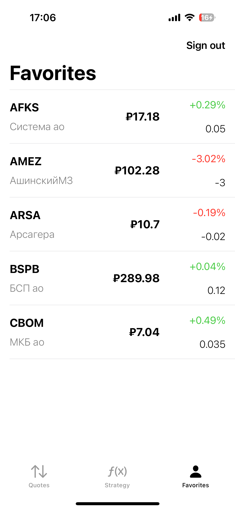

# News app

---

### О проекте

A project developed at the Sirius University Intensive together with specialists from Yandex.

###

<table>
    <td></td>
    <td></td>
    <td></td>
    <td></td>
</table>

## Main part

- quote list
- instrument details with chart
- 3 indicators
  Mandatory 1-2 to choose from
- user portfolio
- portfolio balancing suggestions
- market news

## Nice to have

- authorization
- analytics (metric events)

## Links

[Program Interface](https://www.moex.com/a2193)

[Queries](https://iss.moex.com/iss/reference/)

[UI refernce](https://dribbble.com/shots/20815352-JStock-App)

## Installation

1. Clone the repo via git clone command

```
https://github.com/MustafaNatur/GO-Invest.git
```

2. Open in Xcode

```
open GoInvest.xcworkspace
```
